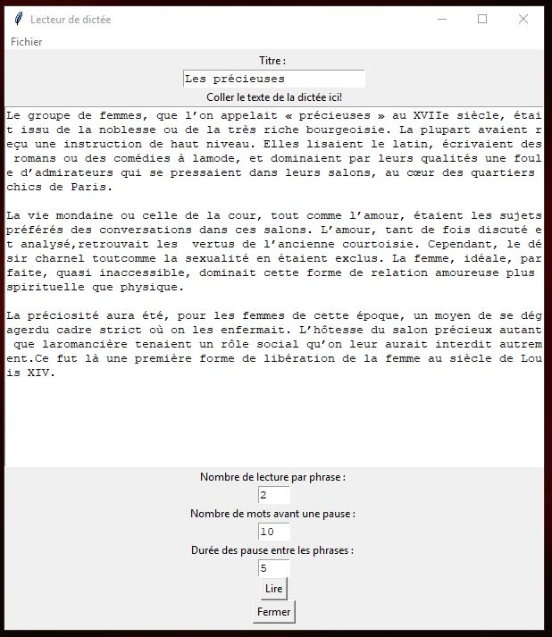

# Lecteur de dictée

## Description

Ce projet est un lecteur de dictée permettant de s'entrainer à écrire. Le programme est très simple à utiliser. Premièrement, on colle le text de la dictée dans la fenêtre. Il est possible d'ajuster trois paramètres : le nombre de fois que chaque bout de phrase est prononcé, le nombre de mots par bout de phrase prononcé et la durée des pauses entre les phrases prononcées. Ensuite on appuie sur 'Lire' et la dictée est lue selon les paramètres. Il est possible de changer les paramètres pendant la dictée. 

À l'ouverture du programme l'état ou le programme se trouvait à la fermeture est repris. Il est possible d'enregistre une dictée avec le menu 'Fichier > Enregister'. Il est aussi possible d'en ouvrir avec le menu 'Fichier > Charger'. Pour que le programme enregistre l'état de la fenêtre, il faut utiliser le boutton 'Fermer' en bas de la fenêtre ou le menu 'Fichier > Quitter'. Le 'X' en haut a droite n'enregistre pas les paramètres.

Pour l'instant la personne qui utilise le programme doit se corriger elle-même.

## Image
<p align=center>
   <i>Capture d'écran de la fenêtre principale</i><br/>
   <br/>
   <i>Le text présent dans la fenêtre à été trouvée sur ce site : https://www.ccdmd.qc.ca/fr/exercices_pdf/?id=37#</i>
</p>

## Dépendance

* python 3.6 
* TKinter 
* Gtts 
* Playsound

## Installation

Windows 
```
pip install Gtts
pip install playsound 
```

Linux 
```
pip3 install Gtts
pip3 install playsound 
```

## Démarer

Sur windows double cliquer sur `start.bat`. Sur linux il faut faire la commande `python3 main.py`

## TODOs

* Utiliser un mécanisme de jeton pour couper le text 
* Faire en sorte que la liste dans 'Fichier > Ouvrir' s'actualise lorsqu'on enregistre un fichier
* Faire prononcer les signes de ponctuations
* Ajouter un signal pour dire que la dictée est fini
* Ajouter un compteur du nombre de mots dans la fenêtre
* Ajouter un mecanisme de correction 
    * Ajouter une fenêtre pour écrire le text 
    * et/ou 
    * Ajouter la possiblité d'utiliser la camera pour photographier le text 
    * Ajouter la reconnaissance de caractère 
